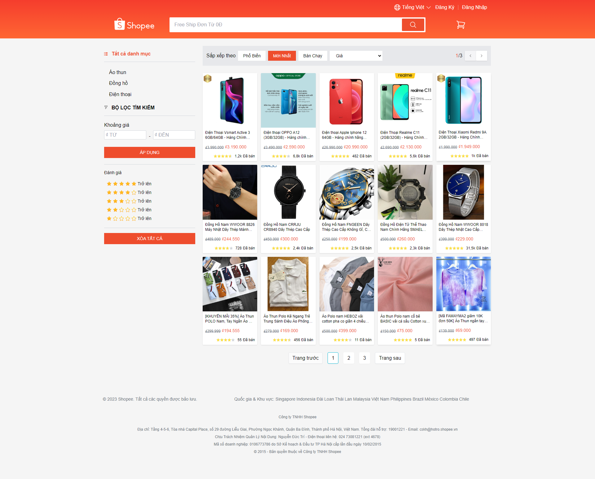

<h1 align="center" style="font-size: 60px">Shopee Clone</h1>

<strong>This is a project to clone the user page of the e-commerce platform Shopee.</strong>

  
  
  

### Live demo: 

🔗 [https://shopee-ui-clone.vercel.app/](https://shopee-ui-clone.vercel.app/)

### Features

- Login management with JWT applies automatic token refresh
- Validate form with Yup and React Hook Form
- Synchronize pagination, filtering, and product searches to URLs to easily share results between devices
- Cart features: add, increase products, delete products in the cart
- Update personal profile
- Paginatate products
- Analyze and optimize build file size for good performance
- SEO with React Helmet
- Separate private route and public route

### Technology

- REST API
- ReactJs
- Typescript
- React Hook Form
- Yup
- React Query
- Vite
- ESLint
- Prettier
- React Helmet
- ...

### Preview

